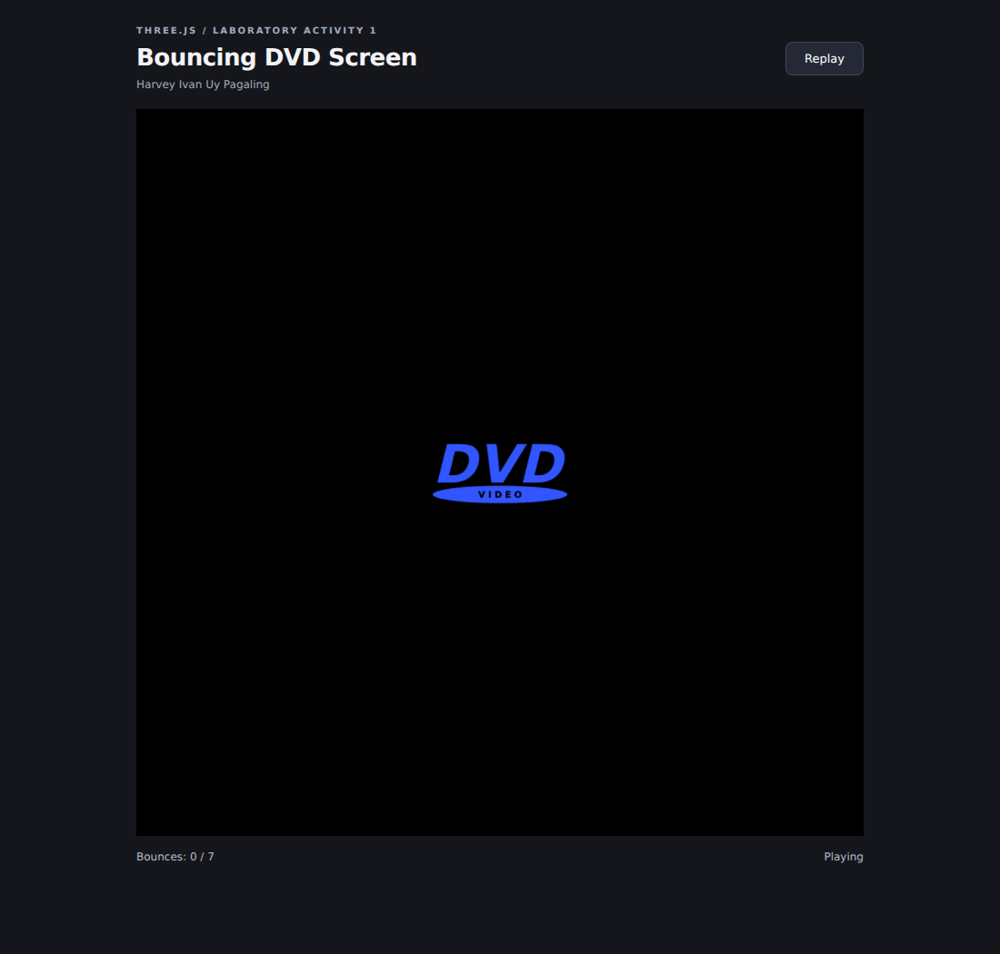

# Laboratory Activity 1 - Bouncing DVD Screen

Three.js assignment by **Harvey Ivan Uy Pagaling**.



## Run

Open `index.html` with VS Code Live Server, or run this command inside the project folder:

```sh
python -m http.server 8000
```

Visit http://localhost:8000. On Windows, `py -m http.server 8000` also works with Python installed. Use a local HTTP server because this project uses JavaScript modules.

Three.js 0.186.1 is included locally with its MIT license. No installation, build step, CDN, or image download is needed. Requires WebGL 2.

## Requirements implemented

- The bouncing object is a Three.js **PlaneGeometry** with a locally drawn transparent DVD-style texture.
- The renderer and displayed canvas are exactly **800 × 800**. Small screens scroll rather than resizing the required scene.
- The object begins at **(0, 0, 0)** on first load and every replay.
- Every edge contact reverses the appropriate velocity component, changes the color, and decreases the scale.
- Bounces 1–6 multiply the original width and height by `0.8 ** bounceCount`. The seventh bounce reduces them to zero and hides the object, satisfying disappearance after 5–8 bounces.
- Simultaneous corner contact counts as one bounce and reverses both directions.
- Replay resets position, color, size, velocity, and bounce count.
- JavaScript and CSS are separate, with descriptive names and comments.

## Files

- `index.html`: page structure and controls.
- `css/style.css`: page styling and fixed scene dimensions.
- `js/main.js`: texture, PlaneGeometry, rendering, collision detection, shrinking, and replay.
- `vendor/three/`: Three.js modules and upstream license.
- `preview.png`: actual rendered screenshot.

## Validation

Browser checks passed for the origin, PlaneGeometry type, 800 × 800 drawing buffer and display, all seven color and scale changes, staying within the scene bounds, disappearance on bounce seven, corner collisions, a large simulation time step, replay, and fixed dimensions in a narrow viewport. No JavaScript errors or failed resource requests occurred.
